  

  <code>own your tools · keep your data · go a layer deeper than the API</code>

  
  
  

 

### An AI product studio

One thesis: **run models locally, keep your data yours.** No cloud dependency, no data leaving your machine.

| Project | What it is | Where |
|---|---|---|
| **AILog** | Open-source CLI, AI-assisted logs | [PyPI](https://pypi.org/) · [GitHub](https://github.com/zoddiacc/AILog) |
| **DocuMind AI** | On-device document assistant | [Play Store](https://play.google.com/store/apps/details?id=com.sanjayjith.docscanner) |
| **Jarvis** | Fully local RAG chat - Ollama + Chroma, cited answers | [GitHub](https://github.com/zoddiacc/jarvis) |
| **AppAssetGen** | Every app icon, one upload - client-side, images never leave the browser | [GitHub](https://github.com/zoddiacc/appassetgen) |

 

### From the builder's seat

Not hot takes, not relays. The stuff you can only write if you've actually built it: what running AI locally really looks like - RAG from scratch, inference plumbing, the parts the tutorials skip - and how low-level systems actually work under the hood.

Mostly on [**X @Zoddiacc**](https://x.com/Zoddiacc).

 

### Where Zodiac comes from

A decade-plus as a platform engineer at the layers most people never touch - the ones deciding whether a system actually boots, talks to hardware, and holds together under load. That instinct carries straight into how I build AI.

 

### Tools

  
  
  
  
  
  
  

 

  <code>@Zoddiacc</code>

